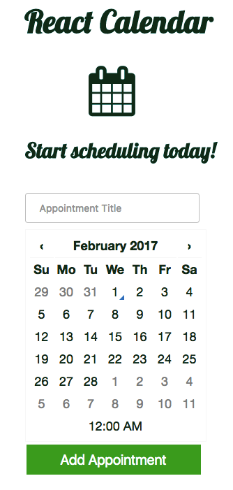

# CalReact
#### Built with React & Rails 5

CalReact is a simple calendar app built as part of the [The Free React on Rails Course](https://learnetto.com/users/hrishio/courses/the-free-react-on-rails-course) on [Learnetto](https://learnetto.com).

#### Features:
* Displays interactive calendar and formatted dates using [react-datetime](https://github.com/YouCanBookMe/react-datetime) and [Moment.js](https://momentjs.com/)

#### Added Style:
* Font Awesome calendar icon
* [Lobster font](https://fonts.google.com/specimen/Lobster)
* Enlarged input and button

Checkout my version of CalReact [here](https://lkang-pdx-calreact.herokuapp.com/).

